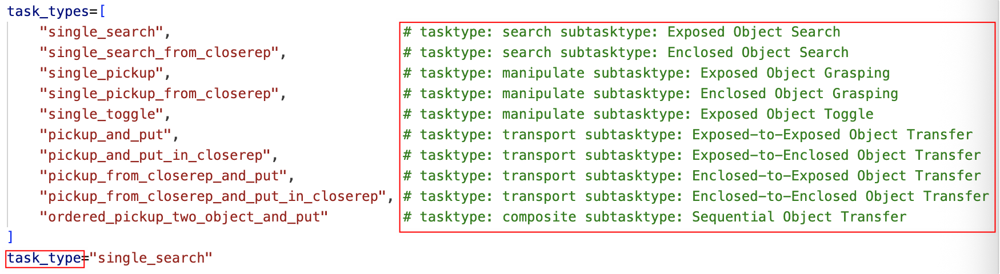
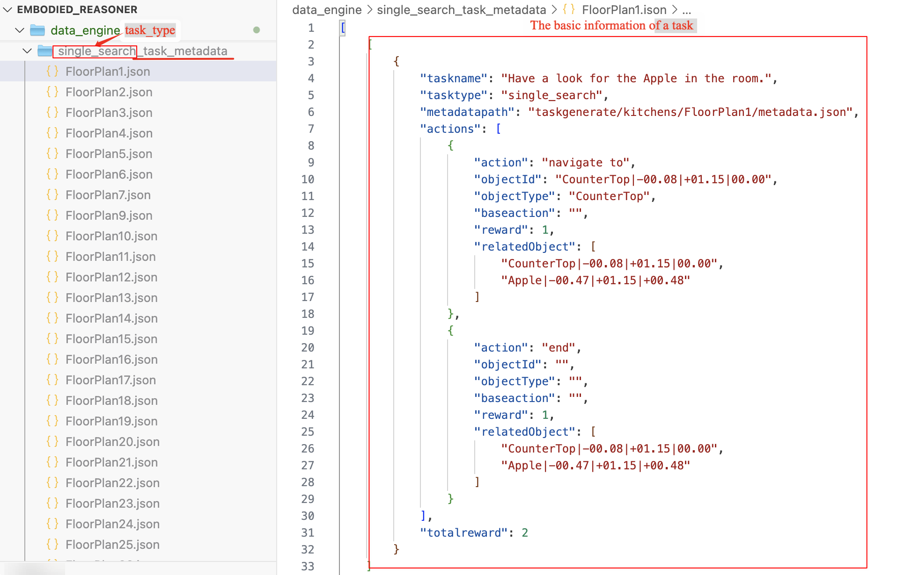

# Data Engine

## Instruction and Key Actions Synthesis

We can use `TaskGenerate.py` to generate basic information related to tasks, such as taskname, key actions, etc.

You can run the following Python script to perform the task generation.
```shell
python TaskGenerate.py
```

**Step 1: Obtain Basic Simulator Scene Information**

The `taskgenerate` folder stores the basic metadata for 120 scenes in the AI2-THOR simulator.

> If this data has not been retrieved yet, it can be obtained by calling the collect_metadata() function.

**Step 2: Generate Basic Task Information**

We can specify the type of task to be generated using the  `task_type` argument.
The `task_types` list defines the 10 currently supported subtask types.

<p align="center">
    
<p>

In addition, you can specify the number of tasks to generate using `num`, and use `floorplans` to define which rooms the tasks should involve.

> Kitchens: FloorPlan1 to FloorPlan30, Living Rooms: FloorPlan201 to FloorPlan230, Bedrooms: FloorPlan301 to FloorPlan330, Bathrooms: FloorPlan401 to FloorPlan430


The generated task metadata will be stored in JSON format in the `<task_type>_task_metadata` folder, with filenames based on the corresponding room numbers.

<p align="center">
    
<p>


## Interleaving Thought Synthesis

After generating the basic task information in JSON format using `TaskGenerate.py`, we can use the two o1StyleGenerate files to generate the trajectories.

`o1StyleGenerate.py` and `o1StyleGenerate_ordered.py` can synthesize trajectories for 10 different sub-task types. 
Specifically, o1StyleGenerate_ordered.py is designed to synthesize more complex sequential object transfer tasks.

You can run the following Python script to perform the trajectory generation. Additionally, you can set the task type and trajectory type within the script (typically, 'b' is shortest, 'a' is longer, and 'c' is the longest).

```shell
python o1StyleGenerate.py
python o1StyleGenerate_ordered.py
```


**Key Parameter Settings**

- You can use the `model` parameter to specify the model used for generating trajectory thoughts.

- The `trajectory_types` parameter controls the complexity of the generated trajectories. i.e., whether the exploration path includes only key actions or also incorporates other search areas.
    
    *Trajectories with trajectory_idx type b include only key actions, while types a and c usually involve searching additional locations.*

- Similarly, the `tasktype` parameter specifies the type of task, allowing the script to load corresponding task metadata from TaskGenerate.

- Additionally, by adjusting the `floorplans` and `tasks` parameters, you can control the range of rooms and the number of tasks for which trajectories are generated.


Below is an example folder of a generated trajectory, including the JSON file and associated images for the trajectory.
<p align="center">
    
<p>


Below is an example of the JSON file contents:

```json
{
    "scene": "FloorPlan1",
    "tasktype": "...",
    "taskname": "Locate the Apple in the room.",
    "trajectory": [
        "<...>...</...>",
        "<...>...</...>",
        "..."
    ],
    "images": [
        ".../init_observe.png",
        "..."
    ],
    "flag": "",
    "time": "...",
    "task_metadata": {
        "..."
    }
}
```
- **scene:** the scene where the task is performed.
- **tasktype:** the type of the task.
- **taskname:** the name of the task.
- **trajectory:** reasoning and decision-making content of the trajectory
- **images:** paths to corresponding images (the first image represents the initial state; each subsequent image corresponds to the state after performing each action listed in trajectory).
- **time and flag:** records the generation timestamp and exceptions encountered during trajectory generation.
- **task_metadata:** task information generated during Step 1.