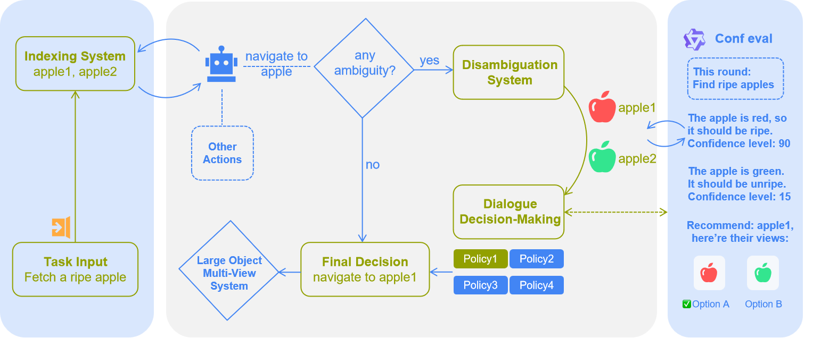

# Evaluation Framework

## Table of Contents

- [Structure](#structure)
- [Core Components](#core-components)
  - [AI2-THOR Engine](#1-ai2-thor-engine-ai2thor_engine)
  - [Evaluation System](#2-evaluation-system)
  - [Web Dashboard](#3-web-dashboard-web_ui)
  - [Prompts and Configuration](#4-prompts-and-configuration)
  - [Data Management](#5-data-management-data)
- [LOCAL Mode Setup](#local-mode-setup)
- [Configuration](#configuration)
- [Testing Examples](#testing-examples)
- [Troubleshooting](#troubleshooting)
- [Log Examples](#log-examples)

## Structure

```
evaluate/
├── ai2thor_engine/
│   ├── RocAgent.py        # Enhanced navigation with 3 disambiguation modes
│   ├── baseAgent.py       # Base agent primitives
│   └── components/
├── data/                   # Evaluation data and cached results
│   ├── agent_positions.json  # Pre-computed navigation positions
│   ├── item_image/
│   └── test_improvement/
├── web_ui/
│   ├── server.py
│   ├── monitor.py
│   ├── static/
│   └── templates/
├── evaluate.py             # Main evaluation script with task filtering
├── web_dashboard.py
├── show_result.py
├── VLMCall.py
├── VLMCallapi_keys.py
├── prompt.py
└── utils.py
```



## Core Components

### 1. AI2-THOR Engine (`ai2thor_engine/`)

The core agent implementation module that handles navigation and interaction within AI2-THOR environments. This module provides the fundamental capabilities for embodied agents to perceive, reason, and act in simulated spaces.

#### `RocAgent.py`

The agent supports **4 navigation modes** for handling multiple similar objects:

1. **Original Mode (No optimization)**: Standard navigation without enhanced disambiguation
   - Enable: Set `enable_dialogue_system = False` ([line 105](../ai2thor_engine/RocAgent.py#L105))

2. **Human-First VLM Fallback Mode** (Optimized): Prioritizes human decision-making with timeouts, falling back to VLM-based selection
   - Enable: Set `enable_dialogue_system = True` ([line 105](../ai2thor_engine/RocAgent.py#L105))
   - Set `disambiguation_mode = "human_first_vlm_fallback"` ([line 112](../ai2thor_engine/RocAgent.py#L112))

3. **VLM-First Human Choice Mode** (Optimized): VLM performs analysis and provides recommendations (confidence scores), with human making the final selection
   - Enable: Set `enable_dialogue_system = True` ([line 105](../ai2thor_engine/RocAgent.py#L105))
   - Set `disambiguation_mode = "vlm_first_human_choice"` ([line 112](../ai2thor_engine/RocAgent.py#L112))

4. **Human-Only Random Fallback Mode** (Optimized): Pure human control with random selection as fallback mechanism
   - Enable: Set `enable_dialogue_system = True` ([line 105](../ai2thor_engine/RocAgent.py#L105))
   - Set `disambiguation_mode = "human_only_random_fallback"` ([line 112](../ai2thor_engine/RocAgent.py#L112))

**Enhanced Multi-object Disambiguation**

  - Individual navigation and photography for each candidate object ensures unique visual context
  - Spatial reasoning with automatic object indexing (e.g., Cabinet_1, Cabinet_2)
  - Web-based interactive selection interface for human-in-the-loop decisions

**Multi-view Observation System**

  - Large object detection based on configurable volume/surface area thresholds
  - Dynamic viewpoint calculation using greedy angle selection algorithm
  - 60-degree overhead viewing angle optimization for improved object recognition
  - Adaptive vision control through `adjust_height()` and `adjust_view()` methods

**Enhanced Configuration Methods**

  - `set_task_context()`: Provides task-specific context to improve VLM reasoning accuracy
  - `enable_enhanced_navigation()`: Unified configuration method for all navigation features
  - `enable_enhanced_features()`: Fine-grained control over disambiguation parameters and timeouts

#### `baseAgent.py`

- Base class for embodied agents with **Core navigation primitives** (move, rotate, teleport), **Object interaction methods** (pickup, put, open, close) and **Vision optimization functions**
- Event handling and state management

#### `components/Action.py`

- Action mapping and execution in AI2-THOR
- Error handling and recovery mechanisms

#### `utils.py`

- Visibility calculations
- Position computations
- Scene analysis utilities

### 2. Evaluation System

#### `evaluate.py`

Main evaluation script with comprehensive task management and monitoring capabilities.

**Task Management Features**

- **Task Filtering by Array Indices**: Support for loading specific tasks using `--task_ids 0,5,10`
- **Intelligent Caching**: Automatic detection and skipping of completed tasks for efficient evaluation resumption
- **Batch Processing**: Configurable batch sizes for handling large evaluation datasets
- **Error Recovery**: Robust error handling that prevents single task failures from terminating entire evaluation runs

**Dashboard Integration**

- **Automatic Web UI Launch**: Dashboard server starts automatically when running in dialogue mode
- **Real-time Monitoring**: Live tracking of agent actions and task progress through web interface
- **Configurable Port Selection**: Flexible port assignment using `--dashboard_port` parameter
- **Graceful Fallback**: Evaluation continues normally even if web UI initialization fails

**Usage Examples:**

```bash
# Test specific tasks by array indices
python evaluate/evaluate.py --task_ids 0,5,10,124 --dashboard_port 8080 --total_count 1

# Full evaluation with real-time monitoring
python evaluate/evaluate.py --total_count 100 --batch_size 10 --dashboard_port 8888

# Headless evaluation (no dashboard)
python evaluate/evaluate.py --no_dashboard --total_count 50

# Single task evaluation
python evaluate/evaluate.py --task_ids 124 --total_count 1
```

### 3. Web Dashboard (`web_ui/`)

Modular real-time monitoring interface providing comprehensive debugging and human-in-the-loop interaction capabilities.

#### `server.py`

Flask-based web server providing the backend infrastructure:

- **Real-time Task Monitoring**: Live tracking of agent actions and task progress
- **Interactive Disambiguation**: Web-based interface for human object selection with image displays
- **Timeout Management**: Configurable timeout handling with graceful fallback mechanisms
- **WebSocket Support**: Real-time bidirectional communication for responsive updates

#### `monitor.py`

Global state management module:

- **Task Lifecycle Tracking**: Complete monitoring from task initialization to completion
- **Interaction Logging**: Detailed recording of all agent actions and decisions
- **Disambiguation History**: Comprehensive tracking of VLM vs human decision patterns
- **State Broadcasting**: Real-time state synchronization across all connected clients

### 4. Prompts and Configuration

#### `prompt.py`

Contains task-specific prompts:

- `EMBODIED_SYSTEM_PROMPT`: System role definition
- `TASK_PREFIX_PUT`: Standard task instructions
- `TASK_PREFIX_PUT_IN`: Container interaction tasks
- Action descriptions and available commands

### 5. Data Management (`data/`)

#### Structure:

```
data/
├── agent_positions.json    # Pre-computed navigation positions
├── item_image/             # Cached object images by floor plan
├── test_improvement/       # Test scenarios for new features
└── [model_name]/          # Model-specific results
    └── [task_id]/         # Task execution records
        ├── result.json    # Task outcome
        ├── *.png          # Captured images
        └── candidate_*.png # Disambiguation images
```

## LOCAL Mode Setup

### Prerequisites (Multi-Terminal Setup)

Before running LOCAL mode evaluation, you need to start two backend services:

#### Step 1: Start Embedding Service (CPU)
The embedding model service for object matching:
```bash
python inference/local_deploy.py --embedding 1 --port 20000
# Wait until you see: Running on http://127.0.0.1:20000
```

#### Step 2: Start VLM Inference Service (GPU)
The Vision-Language Model inference service:
```bash
CUDA_VISIBLE_DEVICES=1 python inference/local_deploy.py \
    --frame "hf" \
    --model_type "qwen2_vl" \
    --model_name "/path/to/your/finetuned/model" \
    --port 10001

# Wait until you see: Running on http://127.0.0.1:10001
```

#### Step 3: Run Evaluation
Now you can run your evaluation scripts.

## Configuration

### Environment Variables

```bash
# Model execution mode
MODE="API"                    # Options: "API" or "LOCAL"
PLATFORM_TYPE="GPU"          # Options: "GPU" or "CPU"
```

### Task Configuration

Tasks are defined in JSON format with enhanced metadata:

```json
{
  "identity": "task_001",
  "taskquery": "Put the coffee mug on the kitchen table",
  "scene": "FloorPlan1",
  "tasktype": "pickup_and_put",
  "instruction_idx": 0,
  "max_steps": 30,
  "target_objects": ["Mug", "DiningTable"],
  "related_objects": ["Coffee", "Kitchen"],
  "navigable_objects": ["Cabinet", "CounterTop"]
}
```

## Testing Examples

```bash
# Launch standalone dashboard
python evaluate/web_dashboard.py

# Single task evaluation
python evaluate/evaluate.py --task_ids 124 --total_count 1

# Test specific tasks by array indices
python evaluate/evaluate.py --task_ids 0,5,10 --dashboard_port 8080 --total_count 1

# For more usage, run `python evaluate/evaluate.py --help`
```

## Troubleshooting

### Web Dashboard Not Accessible

If you cannot access the web dashboard at `localhost:your_port(e.g. 8083)`:

#### Recommended Solution: SSH Port Forwarding
For remote servers, use SSH port forwarding to access the dashboard locally:

```bash
# Single port forwarding (run on your local machine)
ssh -L 8083:localhost:8083 user@server -p port

# Multiple ports forwarding for parallel evaluation
ssh -L 8083:localhost:8083 -L 8084:localhost:8084 user@server -p port
```

Then open `http://localhost:8083` in your local browser.

## Log Examples

A successful task execution typically shows:

```
RocAgent Initialization successful!!!
******** Task Name: Put the mug on the table *** Max Steps: 30 ********
******** Task Record: ./data/Qwen2-VL-7B/001_pickup_and_put_FloorPlan1_0 ********
1 ****** begin exec action: navigate to CounterTop_1 ***
1 ****** end exec action: navigate to CounterTop_1 ***
2 ****** begin exec action: pickup Mug ***
2 ****** end exec action: pickup Mug ***
3 ****** begin exec action: navigate to DiningTable ***
3 ****** end exec action: navigate to DiningTable ***
4 ****** begin exec action: put Mug ***
4 ****** end exec action: put Mug ***
--taskxxx evaluate successed---
```
