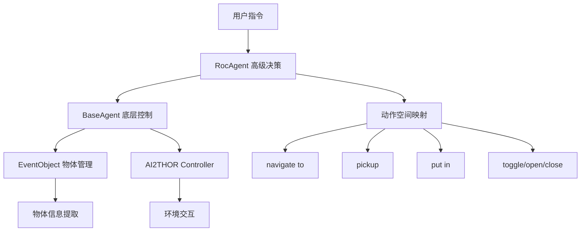

# 第一阶段：Embodied-Reasoner 核心系统分析报告

## 🎯 **项目概览**
本阶段完成了对 Embodied-Reasoner 项目的深度代码分析，重点识别出**同名物体混淆**和**大型物体交互精度不足**两大核心问题的技术根源。

---

## 📊 **数据流架构分析**

### 核心类职责划分



### 关键数据流路径

1. **指令处理流程：**
   ```
   用户指令 → RocAgent.exec() → BaseAgent.action_space → AI2THOR API
   ```

2. **物体识别流程：**
   ```
   AI2THOR event → EventObject.get_objects() → item2object 映射 → 物体操作
   ```

3. **定位计算流程：**
   ```
   物体信息 → calculate_best_view_angles() → 几何角度计算 → 视角调整
   ```

---

## 🔍 **核心问题技术分析**

### 问题一：同名物体混淆 (Homonym Ambiguity)

**📍 问题位置：**
- `evaluate/ai2thor_engine/utils.py` 第15-19行
- `data_engine/eventObject.py` 第12-16行

**🐛 代码问题：**
```python
# 当前有问题的实现
item2object = {}
for item in objects:
    item2object[item["name"]] = item  # ❌ 使用物体类型名作为键
```

**⚠️ 问题分析：**
- **根本原因**: 使用 `item["name"]` (如 "Cup", "Book") 而非 `item["objectId"]` (如 "Cup_12345678") 作为字典键
- **后果**: 当场景中存在多个同类物体时，后加载的物体会覆盖先前的，导致只能访问最后一个实例
- **影响范围**: 所有依赖 `item2object` 的物体查找和操作都会受影响

**✅ 正确实现应该是：**
```python
# 修复后的实现
item2object = {}
for item in objects:
    item2object[item["objectId"]] = item  # ✅ 使用唯一ID作为键
    
# 同时需要维护类型到实例列表的映射
type2objects = {}
for item in objects:
    if item["objectType"] not in type2objects:
        type2objects[item["objectType"]] = []
    type2objects[item["objectType"]].append(item)
```

### 问题二：大型物体交互精度不足 (Large-Object Interaction Precision)

**📍 问题位置：**
- `evaluate/ai2thor_engine/baseAgent.py` 第1024-1050行 `calculate_best_view_angles` 函数

**🐛 代码问题：**
```python
def calculate_best_view_angles(self, item):
    # 只计算到物体中心的角度
    look_vector = np.array([
        item["axisAlignedBoundingBox"]["center"]["x"] - camera_position["x"],
        item["axisAlignedBoundingBox"]["center"]["y"] - camera_position["y"], 
        item["axisAlignedBoundingBox"]["center"]["z"] - camera_position["z"]
    ])
    # ❌ 仅基于几何中心计算，无法处理精细交互需求
```

**⚠️ 问题分析：**
- **根本原因**: 定位逻辑仅依赖物体的几何中心点和简单的角度计算
- **局限性**: 
  - 对于大型物体（如沙发、桌子），无法区分不同的交互区域
  - 无法理解"沙发扶手"、"桌子边缘"等语义化的精确位置
  - 缺乏对物体可交互区域（Affordance）的理解
- **影响场景**: "把杯子放在沙发的右侧扶手上"这类需要精确定位的指令

---

## 🏗️ **系统架构关键发现**

### 类设计分析

1. **BaseAgent (基础智能体)**
   - **职责**: AI2THOR控制器管理、基础移动导航、视角调整
   - **优势**: 提供了完整的底层API封装
   - **不足**: 定位算法过于简单，缺乏精细化感知

2. **EventObject (事件对象管理器)**
   - **职责**: 统一管理场景中的物体信息
   - **优势**: 提供了丰富的物体属性查询接口
   - **关键缺陷**: `item2object` 映射机制存在同名物体覆盖问题

3. **RocAgent (任务执行智能体)**
   - **职责**: 继承BaseAgent，添加高级任务决策能力
   - **动作空间**: `navigate to`, `pickup`, `put in`, `toggle`, `open`, `close`
   - **依赖关系**: 严重依赖EventObject的物体映射

### 关键发现

1. **单点故障**: EventObject的`item2object`映射是系统的单点故障源
2. **扩展性问题**: 当前架构难以支持精细化的空间推理
3. **感知局限**: 缺乏深度图、点云等精细化感知模块

---

## 🎯 **问题优先级与影响评估**

### 高优先级 (影响所有多物体场景)
- **同名物体混淆**: 影响所有包含多个同类物体的场景
- **预计修复时间**: 1-2天 (直接修改映射逻辑)

### 中优先级 (影响精细化操作)
- **定位精度不足**: 影响需要精确定位的复杂操作
- **预计开发时间**: 2-4周 (需要新增感知模块)

---

## 📋 **下一阶段行动计划**

### 立即可执行 (本周内)
1. **修复 item2object 映射问题**
   - 修改 `utils.py` 和 `eventObject.py` 中的映射逻辑
   - 添加类型到实例列表的映射
   - 编写单元测试验证修复效果

### 第二阶段准备 (下周开始)
1. **开始点云处理模块设计**
   - 研究AI2THOR的深度图和实例分割API
   - 设计SpatialSignature数据结构
   - 准备PCA和空间网格化算法

### 技术风险评估
- **低风险**: item2object修复 (不影响现有API)
- **中风险**: 点云处理性能优化
- **高风险**: 与现有代码的集成兼容性

---

## 🔧 **环境验证结果**

### AI2THOR 测试结果 ✅
- **基础功能**: 全部通过
- **深度图获取**: 成功 (300x300)
- **实例分割**: 成功 (9个物体实例)
- **物体列表**: 成功 (77个总物体，4个可见)
- **移动导航**: 成功
- **相机内参**: 需要X Display (非阻塞问题)

### 环境状态
- **conda环境**: `er_eval` 配置正确 
- **依赖包**: 已安装完整
- **AI2THOR版本**: 5.0.0 运行正常

---

## 📝 **总结**

通过本阶段的深度分析，我们精确定位了影响Embodied-Reasoner性能的两大技术瓶颈，并制定了明确的解决路径。**同名物体混淆问题**可以通过直接修改代码快速解决，而**交互精度不足问题**则需要在第二阶段通过引入精细化感知模块来系统性解决。

下一步我们将开始**第二阶段：精细化感知模块开发**，重点实现6D位姿估计与空间签名系统。 